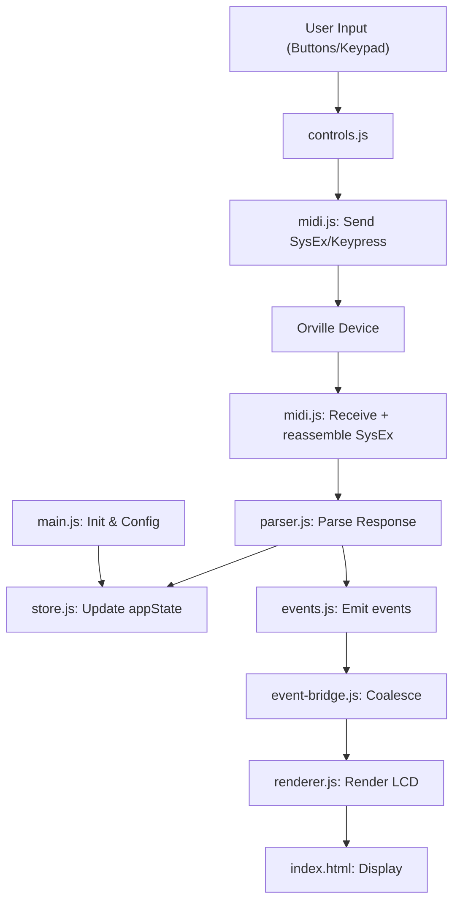

# Orville Commander

A web-based remote interface for viewing and controlling the Eventide Orville effects processor screen via MIDI. Built with WebMIDI, JavaScript, and HTML/CSS. The goal is to enable remote access on devices like browsers, with future cross-platform potential once a prototype is complete.

## Table of Contents
- [Overview](#overview)
- [Setup and Installation](#setup-and-installation)
- [Architecture](#architecture)
- [Key Modules](#key-modules)
- [Data Flow](#data-flow)
- [Known Issues and Refactoring Opportunities](#known-issues-and-refactoring-opportunities)
- [Contributing](#contributing)

## Overview
This project emulates the Orville's LCD screen and controls in a browser, using SysEx MIDI messages for communication. It parses responses, renders the screen as text/HTML (with optional bitmap canvas), and handles user interactions like keypresses and value changes.

- **Core Features**:
  - MIDI connection and SysEx handling.
  - Screen rendering (text-based with params, softkeys, and breadcrumbs).
  - Virtual controls (buttons, keypad).
  - State management for navigation (key stack, values).
  - Debugging tools (logs, polling, config saving).

- **Tech Stack**:
  - JavaScript (ES modules).
  - WebMIDI API for MIDI.
  - HTML/CSS for UI.
  - Runtime dep: `webmidi` only. Dev: Vite, Jest, ESLint, Prettier.

## Setup and Installation
1. Clone the repo: `git clone <repo-url>`.
2. Install dependencies: `npm install`.
3. Start the dev server: `npm run dev` (Vite), then open the printed URL in Chrome, Edge, or Opera (WebMIDI support; Firefox/Safari silently fail).
4. Connect MIDI devices via the UI (select input/output ports).
5. Configure device ID (default: 0) and other settings (log level, bitmap fetching).
6. Use the virtual panel to navigate and interact.

**Dependencies**: `webmidi` (runtime); requires browser MIDI access.

## Architecture
The app follows a modular structure with separation of concerns:
- **State Management**: Centralized in `state.js`/`store.js` (appState object behind an audited `setState`).
- **MIDI Communication**: Handled in `midi.js` (send/receive SysEx, inbound reassembly).
- **Parsing**: In `parser.js` (processes responses, emits events).
- **Rendering**: In `renderer.js` (LCD HTML) and `bitmap.js`/`framebuffer.js` (screen-capture canvas), driven by `event-bridge.js` off the `events.js` bus.
- **Controls/UI**: In `controls.js` and `index.html` (button events).
- **Config/Persistence**: In `config.js` (localStorage).
- **Entry Point**: `main.js` (initializes everything, event listeners).

High-level diagram:

## Key Modules

* state.js / store.js: Holds global appState (e.g., currentKey, values, stack) behind `setState`. Why? Single source of truth for reactivity.

* midi.js: Manages ports, listeners, SysEx commands (e.g., sendObjectInfoDump), and inbound multi-packet reassembly. Key functions: setMidiPorts, sendSysEx, addSysexListener.

* parser.js: Parses ASCII dumps into subs/objects and emits events. Exports: parseResponse.

* event-bridge.js / events.js: Pub/sub bus + render-timing coalescer between parser and renderer.

* renderer.js: Builds HTML for LCD (params, softkeys, breadcrumbs). Handles clicks/changes. Exports: updateScreen, renderScreen.

* bitmap.js / framebuffer.js: Decode the `0x17` screen dump and paint the capture canvas. Exports: renderBitmap, computePixels.

* controls.js: Maps buttons to keypress masks; sets up event listeners. Exports: setupKeypressControls.

* main.js: Bootstraps app, connects MIDI, adds listeners. Exports: showLoading, hideLoading.

* config.js: Loads/saves config (ports, logs). Exports: loadConfig, saveConfig.

* index.html: UI layout (LCD, buttons, debug tools).

## Data Flow

1. User clicks button → controls.js sends keypress via midi.js.

2. Device responds with SysEx → midi.js listener reassembles it → parser.js processes.

3. parser.js updates appState (store.js) and emits events on events.js.

4. event-bridge.js coalesces and renderer.js re-renders the LCD (index.html).

5. For values: Similar flow with VALUE_DUMP/PUT.

Polling (e.g., meters) runs intervals in main.js.

## Known Issues and Refactoring Opportunities

The eight-step decoupling refactor that resolved the original tight-coupling,
testing, and render-pipeline items is complete (merged in PR #23). Active
production-readiness work is tracked in the checked-in ledger
[`docs/issue-tracker.md`](docs/issue-tracker.md) (mirrored to
[GitHub Issues](https://github.com/auntiepickle/orvilleCommander/issues)), with
the Phase 3 design in
[`docs/refactor/phase3-state-model.md`](docs/refactor/phase3-state-model.md).

The SysEx wire format is in [`docs/protocol.md`](docs/protocol.md) and the
device behaviour spec in [`docs/device-model.md`](docs/device-model.md).

## Contributing

* Fork and PR changes.

* Focus on one feature/fix per PR (e.g., "Add JSDoc to midi.js").

* Use git commit messages like: "docs: add initial README structure for overview and architecture".
